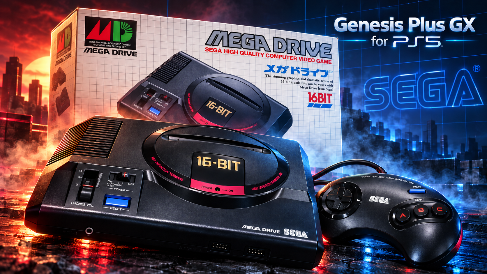

# Genesis Plus GX PS5

[Genesis Plus GX](https://github.com/ekeeke/Genesis-Plus-GX) 1.7.4, the accurate Sega 8/16-bit emulator, running on
a jailbroken PS5 as a **native home-screen app** with its own icon and background. One app plays:

| System | Files | BIOS needed (in `/data/genplus/bios/`) |
|---|---|---|
| Mega Drive / Genesis (SVP games such as Virtua Racing included) | `.md` `.gen` `.smd` `.bin` `.mdx` | none |
| Sega CD / Mega-CD | `.cue` (+ its tracks), `.chd`, `.iso` | `bios_CD_U.bin` (USA), `bios_CD_E.bin` (Europe) or `bios_CD_J.bin` (Japan) -- one is enough |
| Master System / Mark III | `.sms` | none |
| Game Gear | `.gg` | none |
| SG-1000 | `.sg` | none |

Cartridge games can also be inside a `.zip`. A Sega CD game started without a BIOS says which files are needed,
and where they go, on the screen. The `.bin` tracks named in a `.cue` are not listed as games of their own.

**Inside the emulator, to access the main menu press L3 + R3.**

The PS5 layer follows the layout of PS5SX2 (the PCSX2 port) and of Snes9x PS5 and Mesen2 PS5, the ports it comes
from:

- `ps5/coreorbis` holds `main-boot.cpp`, the `orbis-shims/` and `include-orbis/`;
- `ps5/frontend` holds the user interface, the 3D game shelf and the glue to the Genesis Plus GX core;
- `ps5/proto/native` builds and signs `eboot.bin`;
- `ps5/installer` is the installer and helper payload.

Everything outside `ps5/` is the original Genesis Plus GX source, unchanged, apart from this README (the original
one is [README-Genesis-Plus-GX.md](README-Genesis-Plus-GX.md)). The core (`core/`, with its CD
hardware, libchdr, Tremor and the Nuked/MAME sound chips) and its libretro port (`libretro/libretro.c`) are
compiled as they are: all 100 of their C files build for the PS5 without a single change. The frontend drives the
core through its libretro interface -- the most complete of its ports -- and plays the part RetroArch plays on a
PC; the GameCube/Wii user interface (`gx/`) and the other ports are not used.

> **Status (1.5):** builds with the ps5-payload-dev SDK into a signed native app, and passes 231 host tests, which
> run the same code (the Genesis Plus GX core included) on Linux with the PS5 calls simulated: a test program for
> each of Mega Drive, Master System and Game Gear is played through the whole chain -- the shelf, the pad, the
> core, the video and sound output. If something fails, the logs in
> `/data/genplus/logs/` say where.

## How it works

The PS5 gives the controller only to the app in front, so Genesis Plus GX runs as a native app opened from its
icon, and the payload you send is its installer:

| Piece | What it is | In PS5SX2 |
|---|---|---|
| `eboot.bin` in `/data/homebrew/PPSA99011/` | **Genesis Plus GX itself**, a native app opened from its icon | PCSX2 (PPSA99203) |
| `sce_module/libc.prx` | the C runtime module every native app carries | the same file, byte for byte |
| `GenesisPlusGXPS5.elf` (payload) | the **installer**: installs or updates the app, then stays running as the **helper** | PS5SX2Installer.elf + PS5SX2Helper.elf |

When it opens, the app asks the helper to let it out of its sandbox; without that an app sees neither `/data`
nor USB drives. The request is the one PS5SX2 makes:

- **Who is asked, in order:** the Genesis Plus GX helper (127.0.0.1:9081; up to 1.4 the helper used 9077 and is
  left alone), then etaHEN (9028) and the daemon on port 9069.
- **If nobody answers:** the app carries a copy of the helper (`GenesisPlusGXPS5-helper.elf`), sends it to the ELF
  loader (127.0.0.1:9021) and asks again. So the icon keeps working after a reboot, as long as the ELF loader
  runs.
- **What the helper allows:** only title PPSA99011. It gives the process the system's root folder and uid 0, as
  elfldr does for payloads. No other app is touched.

Genesis Plus GX PS5 only uses `/data/genplus/`, `/data/homebrew/PPSA99011/` and its own
`/user/appmeta/PPSA99011/`. It sits next to Snes9x PS5 (PPSA99009, helper port 9080), Mesen2 PS5 (PPSA99010, port
9076), FBNeo PS5 (PPSA99012, port 9079) and PS5SX2 (PPSA99203) without touching them.

## Versions

Every release carries its version in the file name: `GenesisPlusGXPS5-v1.5.elf` and `genplus-ps5-v1.5-src.zip`
(`make dist`). When updating, replace the old ELF with the new one in your autoload or Payload Manager. In this
README, "`GenesisPlusGXPS5.elf`" always means the current release's ELF.

**1.5:** **Covers download in the background.** 1.4 downloaded them before the app opened (up to 30 s with the
launch screen up) and restarted itself for new ones. Now the helper downloads them while you use the app: it starts
at once, the covers around the selection come first, and each one appears on the shelf as it lands ("Downloading
covers in the background... N left"). After updating, send `GenesisPlusGXPS5-v1.5.elf` once (or let the app start
its helper itself): 1.4's helper keeps running until the console restarts, but 1.5 uses its own (port 9081).

**1.4:** Square (fetch a cover again) works again on the console, and keeps the cover until the new one has
arrived; a ROM named as its official name gets its cover fetched again. **1.3:** CRT shaders (CRT Easymode style by default; see [CRT shaders](#crt-shaders)); MD+ and MSU-MD documented
([MD+ and MSU-MD](#md-and-msu-md-cd-music-in-mega-drive-games)); saves and states in one folder per system; the Sega CD
backup RAM written while the game runs; crash-safe writes; a stricter helper; and the fixes of a full code audit
(720p picture, Resume, odd files in the library, covers, downloads); a setting to turn the debug logs off.
**1.0:** the first release.

## Language

Every screen and notification of Genesis Plus GX PS5 is in English.

## Requirements

- A jailbroken PS5 with **kstuff** (or kstuff-lite) and an **ELF loader** on port 9021: elfldr, etaHEN, or the
  one PS5 Payload Manager uses.
- **ShadowMountPlus**, so the icon appears on the home screen (the same one PS5SX2 uses).
- Your own games, and a Sega CD BIOS for Sega CD games. None are included.

## Install and play

1. **Send `GenesisPlusGXPS5.elf`** with PS5 Payload Manager, or from a PC on the same network:
   ```sh
   nc -q0 PS5_IP 9021 < GenesisPlusGXPS5-v1.5.elf
   ```
   It installs the app in `/data/homebrew/PPSA99011/` (`eboot.bin`, `sce_module/libc.prx`, `param.json`, the
   icon and the backgrounds), shows **"Genesis Plus GX PS5 1.5 installed. Open it from the Genesis Plus GX PS5
   icon on the home screen."** and stays running as the helper.
2. **Open the Genesis Plus GX PS5 icon.** The game shelf appears and the controller works.
3. **Copy your games** to their system's folder, over FTP for example. The app makes the folders on its first
   start:

   | System | Games in | Your covers in |
   |---|---|---|
   | Mega Drive / Genesis | `/data/genplus/roms/MegaDrive` | `/data/genplus/covers/MegaDrive` |
   | Sega CD | `/data/genplus/roms/SegaCD` | `/data/genplus/covers/SegaCD` |
   | Master System | `/data/genplus/roms/MasterSystem` | `/data/genplus/covers/MasterSystem` |
   | Game Gear | `/data/genplus/roms/GameGear` | `/data/genplus/covers/GameGear` |
   | SG-1000 | `/data/genplus/roms/SG1000` | `/data/genplus/covers/SG1000` |

   On a USB drive the same layout goes under `genplus/roms` (`genplus/roms/MegaDrive`...). Subfolders inside
   them are fine (`roms/MegaDrive/RPG/`). The game's system comes from its extension, so a game left directly in
   `roms/` or in another folder is still found. A Sega CD `.cue` must sit next to its `.bin` tracks. The Sega CD
   BIOS goes to `/data/genplus/bios/`.

Tip: put `GenesisPlusGXPS5.elf` in your autoload, as PS5SX2 recommends for its payloads.

**Updating:** send the new `GenesisPlusGXPS5.elf` once. It compares every app file with the copy it carries and
rewrites only what changed; each file is written to a temporary file and then renamed, `eboot.bin` last. The
notification says "Genesis Plus GX PS5 updated to 1.4". A deleted or damaged icon is put back the same way. A
second copy sent while the helper is already running only installs and exits.

**If "Genesis Plus GX PS5 has no access to /data" appears:** no helper answered and the ELF loader wasn't
running. Send `GenesisPlusGXPS5.elf` and open the icon again.

| Folder | Contents |
|---|---|
| `/data/genplus/roms/<system>` | your games: `MegaDrive`, `SegaCD`, `MasterSystem`, `GameGear`, `SG1000` |
| `/data/genplus/bios` | `bios_CD_U.bin` / `bios_CD_E.bin` / `bios_CD_J.bin` for the Sega CD |
| `/data/genplus/saves` | battery saves, one folder per system (`saves/MegaDrive/<game>.srm`, written within 3 seconds of a change and when the game closes, an erase included) and the Sega CD backup RAM (`scd_U.brm`..., also written within 3 seconds of a change) |
| `/data/genplus/states` | save states, one folder per system: `states/MegaDrive/<game>.state1` to `.state10` (a Mega Drive and a Master System game of the same name never share one; saves of the first 1.0 builds, directly in `saves/` and `states/`, are moved there the first time the game starts) |
| `/data/genplus/covers/<system>` | downloaded covers and your own, one folder per system (the same names as in `roms/`); `covers/` itself keeps `wanted.txt` and `crc-cache.txt` |
| `/data/genplus/logs` | `boot.log` (the app), `installer.log` (installer/helper), `helper.log` (the helper the app starts), and the previous session's `.prev.log` files |
| `/data/genplus/genplus-ps5.ini` | the menu settings |

### The home-screen app

```
/data/homebrew/PPSA99011/
  eboot.bin              Genesis Plus GX (a native app, signed as PS5SX2's is), with the helper inside
  sce_module/libc.prx    the native app's C runtime (the same as PS5SX2's and ps5-native-app-boilerplate's)
  sce_sys/param.json     title "Genesis Plus GX PS5", ID PPSA99011
  sce_sys/icon0.png      the icon: the "Genesis Plus GX for PS5" art (512x512; ps5/app/sce_sys/icon0.png in the source)
  sce_sys/pic0.dds       the home-screen background while the icon is selected (3840x2160, BC7)
  sce_sys/pic1.dds       the launch background (the same image)
```

The icon is the project's official art, `ps5/app/sce_sys/icon-source.png` (1254x1254): a Mega Drive pad under
the "Genesis Plus GX for PS5" title. `icon0.png` is that image at 512x512. To change the icon, replace
`ps5/app/sce_sys/icon0.png` (512x512 PNG) and rebuild. The background -- the large image behind the icon when
Genesis Plus GX PS5 is selected on the home screen -- is the project's background art,
`ps5/app/sce_sys/background-source.png` (1672x941: a Mega Drive, its box and pad under the "Genesis Plus GX for
PS5" title), scaled to 3840x2160 and encoded to `pic0.dds`/`pic1.dds` as BC7 (bc7enc_rdo, as
ps5-native-app-boilerplate's `tools/prepare-assets.sh --background` does). For another title ID:
`make ps5 TITLE_ID=XXXX00000`.

**Home-screen art:** ShadowMountPlus copies the art in `sce_sys` (icon, backgrounds, `param.json`) to
`/user/appmeta/PPSA99011/` only when it first registers the title, and the system keeps the art it saw at that
moment. The installer keeps that folder current on every update, but if the title was registered before the art
changed, register it again once: select **Genesis Plus GX PS5** on the home screen, press **OPTIONS**, choose
**Delete** (your games, saves and covers in `/data/genplus/` stay), then send `GenesisPlusGXPS5.elf` again.

## The game shelf and covers

The start screen is a 3D shelf of game covers, like PS5SX2's and Snes9x PS5's, with the author's line under the
wordmark: **github.com/MisterTemaki**.

- **All your games at once:** the shelf gathers the games in `/data/genplus/roms` (its system folders) and on USB
  drives (`genplus/roms`), subfolders included, sorted by name. Each game's line says its system and region.
- **One system at a time:** **Up / Down** switch between "All games" and each system that has games (Mega Drive,
  Sega CD, Master System -- SG-1000 included -- and Game Gear). The shelf remembers the last one.
- **Official names:** a game is identified by its file name or, when that doesn't match, by the ROM's CRC32,
  looked up in a table of 6,118 entries built into the app (No-Intro, from libretro-database, for Mega Drive,
  Master System, Game Gear and SG-1000; Redump names for the Sega CD).
  - The CRC is tried on the whole file, then without a 512-byte copier header.
  - Systems that share games are searched together: a Master System game saved as `.gg` gets its Master System
    name and cover.
  - Loose names (`sonic the hedgehog.md`) are recognised too.
  - CRCs are cached in `covers/crc-cache.txt`, so each ROM is read once.
- **Automatic covers, in the background:** box art comes from
  [libretro-thumbnails](https://github.com/libretro-thumbnails) (each system's `Named_Boxarts`) over HTTPS, with
  the console's own `libSceHttp2`/`libSceSsl`.
  - The app can't download once it is out of its sandbox (on the console HTTPS fails at that stage, as Snes9x
    PS5's logs showed), so the **helper** does it (a payload with network access of its own), while you use the
    app. The app opens at once and lists the missing covers in `/data/genplus/covers/wanted.txt`, and the ones
    around the selection in `covers/priority.txt` (fetched first); the helper downloads them one by one, and each
    cover replaces its card on the shelf as it lands. The top right corner shows "Downloading covers in the
    background... N left". The helper keeps going while the app is closed.
  - With another jailbreak daemon instead of the Genesis Plus GX helper (etaHEN, 9069), 1.4's way still works: a
    prefetch before the app asks for `/data` (30 s), and a restart when new games need covers.
  - Covers are saved in their system's folder, `covers/<system>/<name>.png`
    (`covers/MegaDrive/Sonic The Hedgehog (USA, Europe).png`), and never downloaded twice. Covers cached by an
    earlier build as `covers/md - <name>.png` are moved there at the next start. A cover the server doesn't
    have is marked (`.missing`) and only looked for again after 30 days; **Square** forces a new try.
  - Without a network nothing is tried and the shelf works the same.
- **Your own covers:** a `.png` or `.jpg` named after the ROM file, in `/data/genplus/covers/<system>/`
  (`covers/MegaDrive/Sonic.png` for `roms/MegaDrive/Sonic.md`), in `covers/` itself, or next to the ROM, takes
  priority over downloads.
- **No cover:** the game gets a card with its title and system.
- **Turning downloads off:** Settings, "Download covers".

### Downloading all the covers yourself

To fill the shelf without the console downloading anything (an offline PS5, or a big library), download each
system's whole cover set from [libretro-thumbnails](https://github.com/libretro-thumbnails) on a PC:

| System | All covers at once (zip) | Browse | Copy the images to |
|---|---|---|---|
| Mega Drive / Genesis | [master.zip](https://github.com/libretro-thumbnails/Sega_-_Mega_Drive_-_Genesis/archive/refs/heads/master.zip) | [Named_Boxarts](https://github.com/libretro-thumbnails/Sega_-_Mega_Drive_-_Genesis/tree/master/Named_Boxarts) | `/data/genplus/covers/MegaDrive/` |
| Sega CD | [master.zip](https://github.com/libretro-thumbnails/Sega_-_Mega-CD_-_Sega_CD/archive/refs/heads/master.zip) | [Named_Boxarts](https://github.com/libretro-thumbnails/Sega_-_Mega-CD_-_Sega_CD/tree/master/Named_Boxarts) | `/data/genplus/covers/SegaCD/` |
| Master System | [master.zip](https://github.com/libretro-thumbnails/Sega_-_Master_System_-_Mark_III/archive/refs/heads/master.zip) | [Named_Boxarts](https://github.com/libretro-thumbnails/Sega_-_Master_System_-_Mark_III/tree/master/Named_Boxarts) | `/data/genplus/covers/MasterSystem/` |
| Game Gear | [master.zip](https://github.com/libretro-thumbnails/Sega_-_Game_Gear/archive/refs/heads/master.zip) | [Named_Boxarts](https://github.com/libretro-thumbnails/Sega_-_Game_Gear/tree/master/Named_Boxarts) | `/data/genplus/covers/GameGear/` |
| SG-1000 | [master.zip](https://github.com/libretro-thumbnails/Sega_-_SG-1000/archive/refs/heads/master.zip) | [Named_Boxarts](https://github.com/libretro-thumbnails/Sega_-_SG-1000/tree/master/Named_Boxarts) | `/data/genplus/covers/SG1000/` |

1. Download the zip and unpack it on the PC. The covers are in its **`Named_Boxarts`** folder (the zip also has
   title screens and in-game shots: they are not used).
2. Copy the `.png` files from `Named_Boxarts` (not the folder itself) to that system's `covers/` folder, over FTP
   for example. Copying only the covers of the games you have saves space: the zips are large.
3. Open the app: games recognised by name or CRC pick their cover up at once, and nothing is downloaded for them.

Notes:

- The files keep their official names (`Sonic The Hedgehog (USA, Europe).png`); the app looks for exactly that
  name, with the characters `` & * / : ` < > ? \ | " `` replaced by `_` as in the repository. `boot.log` lists the name it found for
  each game (`[games] ... -> "<name>"`).
- A few `.png` files in the repository are git links: a small text file holding the name of another cover. In the
  zip they may come out as text, not images; copy the cover they name under that file's name instead.
- One cover: `https://raw.githubusercontent.com/libretro-thumbnails/<repository>/master/Named_Boxarts/<name>.png`
  (spaces as `%20`).
- A cover named after the ROM file (`covers/MegaDrive/Sonic.png` for `roms/MegaDrive/Sonic.md`) is used before
  any other, for games the app doesn't recognise or to use another picture.

The shelf is drawn by the CPU in real 3D perspective (each cover a quad turned about the vertical axis, drawn
column by column with bilinear filtering, mipmaps and anti-aliased edges, split across several cores), as in
Snes9x PS5.

## Controls

**Inside the emulator, to access the main menu press L3 + R3.**

**On the shelf**

| Button | Does |
|---|---|
| Left / Right (D-pad or stick) | change game (hold to speed up) |
| Up / Down | change system (All games, Mega Drive, Sega CD, ...) |
| L1 / R1 | skip 10 games |
| Cross | play |
| Triangle | settings |
| Square | download this game's cover again (the cover it has stays until the new one has arrived) |
| OPTIONS | quit Genesis Plus GX PS5 (asks first) |

**In a game:** by default, buttons by position, as RetroArch maps them for Genesis Plus GX -- the Mega Drive's
A / B / C row on Square / Cross / Circle, and the 6-button pad's X / Y / Z row on L1 / Triangle / R1. Every
button can be moved (Settings, **CONTROLS**, below). The pad is a 3- or 6-button one as each game's header asks,
unless the settings choose one.

| PS5 | Mega Drive / Sega CD | Master System, Game Gear, SG-1000 |
|---|---|---|
| Square | A | |
| Cross | B | 1 |
| Circle | C | 2 |
| L1 | X | |
| Triangle | Y | |
| R1 | Z | |
| OPTIONS | Start | Pause (Master System) / Start (Game Gear) |
| touchpad click | Mode | |
| D-pad or left stick | D-pad | D-pad |

| Combination | Does |
|---|---|
| L3 + R3 | pause menu: save / load state, slot, settings, reset, power cycle, back to the list, quit |
| L2 + Up / Down | save / load the state in the current slot |
| L2 + Left / Right | change slot (1-10) |
| hold R2 | fast forward (speed in the settings) |
| hold L2 + R2 | rewind |

Two players: player 2 is the second signed-in user's controller. With a 4-player adapter (Settings, CONTROLS),
up to four: players 2 to 4 are the other signed-in users. The light bar shows the player.

## Settings

Triangle on the shelf, or "Settings" in the pause menu:

- **Video:** **shader** (see [CRT shaders](#crt-shaders); CRT Easymode style by default), screen size (fit to
  screen, integer scale, stretch to 16:9), aspect ratio (TV -- the core's own pixel aspect --, square pixels, 4:3,
  16:9), **NTSC filter** (Blargg's: composite, S-Video, RGB, monochrome), show the borders (overscan: off, top and
  bottom, left and right, all), smooth picture and scanlines (for the plain picture, with the shader Off), Game
  Gear LCD ghosting, FPS counter.
- **Audio:** sound on/off, volume, **FM sound chip** (MAME YM2612, MAME ASIC YM3438, Nuked YM2612, Nuked YM3438
  -- the Nuked cores are cycle-accurate and heavier), low-pass filter.
- **Emulation:** fast-forward speed (150% to unlimited), rewind on/off, console region (auto, USA, Europe, Japan),
  remove the sprite limit.
- **Controls:**
  - **Mega Drive / Sega CD pad:** Auto (the default: a 6-button pad for games whose header says they support one,
    a 3-button pad for the rest, as the core decides), 3 buttons, or 6 buttons. Some old games misbehave with a
    6-button pad, and some 6-button games don't say so in their header: this setting fixes either case. Master
    System, Game Gear and SG-1000 games always get their own 2-button pad.
  - **4-player adapter:** Off, 4 Way Play (EA's, for EA Sports and other EA games) or Team Player (Sega's, for
    Gauntlet IV, Columns III...). The pads on it are of the type chosen above (3-button with Auto).
  - **Button layout:** for each button of the Mega Drive pad (A, B, C, X, Y, Z, Start, Mode), the PS5 button that
    presses it: Cross, Circle, Square, Triangle, L1, R1, OPTIONS, the touchpad, or none. B and C are the Master
    System's 1 and 2, and Start its Pause. **Default button layout** puts them back. The layout applies to every
    player. L2, R2, L3 and R3 stay for the hot keys and menus, and the menus always use Cross / Circle.
  - Changes apply at once, in the game too, and are saved in `genplus-ps5.ini` (`pad_type`, `multitap`,
    `btn_a`...`btn_mode`).
- **Library:** download covers.
- **System:** **Debug logs** (On by default) -- see [Debugging](#debugging-logs-and-crashes).

The settings go to the core as its libretro options (`genesis_plus_gx_*`), so they behave as in RetroArch.

## CRT shaders

Every game starts through a CRT shader -- **CRT Easymode style** unless you pick another one. Eleven shaders are
built in; they work on every system (Mega Drive, Sega CD, Master System, Game Gear, SG-1000) and only while a game
is running (the shelf is drawn without them).

**How to use them**

1. **In a game:** press **L3 + R3** to open the pause menu and choose **Settings** (on the shelf: **Triangle**).
2. **Shader** is the first row: **Left / Right** (or **Cross**) go through the list. The picture behind the menu changes at once,
   so you can compare them on the game you are playing.
3. **Circle** closes the settings; the choice is saved and used for every game from then on.
4. **Off** gives the plain picture; with it, the "Smooth picture" and "Scanlines" options apply (with a shader on,
   the shader does that work).
5. The choice is kept in `/data/genplus/genplus-ps5.ini` as `shader=<number>` (the numbers below): you can also
   set it there by hand.

| `shader=` | Shader | Look | Weight | From |
|---|---|---|---|---|
| 0 | Off | the plain picture | -- | -- |
| 1 | **CRT Easymode style** (default) | flat screen, sharp, scanlines that widen on bright colours, aperture grille | medium | written for this port, after the look of EasyMode's crt-easymode |
| 2 | crt-lottes | curved screen, Gaussian beam, shadow mask, a little bloom | heavy | Timothy Lottes (public domain) |
| 3 | crt-lottes-fast | lighter Lottes: curved, 4-tap beam, aperture mask, tone mapping | medium | Timothy Lottes (public domain) |
| 4 | crt-1tap | very light, contrasty dynamic scanlines | light | fishku (CC0) |
| 5 | crt-2tap | crt-1tap with exact blending between two lines | light | fishku (CC0) |
| 6 | crt-hyllian-fast | sharp Catmull-Rom picture, strong scanlines, magenta/green dot mask | medium | Hyllian (MIT) |
| 7 | crt-nobody | curved screen with rounded corners, beam scanlines, magenta/green mask | heavy | Hyllian (MIT) |
| 8 | newpixie-mini | strongly curved TV, colour bleed, vignette, film tone | heavy | Mattias Gustavsson (Unlicense) |
| 9 / 10 | crt-blurPi-sharp / crt-blurPi-soft | light blur and screen-space scanlines (sharp or bilinear) | light | Oriol Ferrer Mesià (MIT) |
| 11 | monoCRT | a monochrome monitor (made for black-and-white pictures) | light | hunterk (public domain) |

Which to pick: **CRT Easymode style** for a sharp, flat arcade-monitor look; **crt-hyllian-fast** for stronger
scanlines and a visible dot mask; **crt-lottes** or **crt-nobody** for a curved TV; **crt-1tap / crt-2tap** when a
game should stay as light as possible.

They come from libretro's [slang-shaders](https://github.com/libretro/slang-shaders) (`crt/`), with their default
parameters. Why these: the PS5 build draws the picture with the CPU (there is no GPU driver for homebrew apps), so
only single-pass shaders are fast enough, and only shaders whose licence fits Genesis Plus GX's (public domain,
CC0, Unlicense, MIT) can be built in. crt-easymode itself is GPL, which the Genesis Plus GX licence can't take in,
so "CRT Easymode style" is original code aiming at the same look. Multi-pass shaders (crt-royale, crt-guest-advanced,
the Mega Bezel...) need a GPU.

How they run: each shader is rewritten in C++ (`ps5/coreorbis/orbis-shims/ProsperoCrt.cpp`). What depends only on
a source line and a screen column (the horizontal filter) is computed once per source line; per screen pixel only
the vertical blend, the beam, the mask and a gamma table remain; curved screens use a per-pixel map built once per
picture size. The work is shared by up to six threads. Every minute in a game, `boot.log` says how long the shader
took per frame (`shader N ms`); if a heavy one (crt-lottes, crt-nobody, newpixie-mini) makes a game slow down,
pick a lighter one. Differences from the GPU versions: curved shaders read the horizontal filter between two
screen columns, monoCRT has no beam jitter.

## MD+ and MSU-MD (CD music in Mega Drive games)

Genesis Plus GX plays Mega Drive games patched to stream **CD-quality music** from audio tracks, as the
MegaSD/Mega EverDrive flash carts and the Sega CD do. Two kinds of patches exist, and the core supports both:

| | **MD+** (MegaSD) | **MSU-MD** |
|---|---|---|
| What it uses | the MegaSD cart's CD audio | the Sega CD hardware, the game running from the cartridge ("Mode 1") |
| Sega CD BIOS needed | no | **yes**: `bios_CD_U.bin`, `bios_CD_E.bin` or `bios_CD_J.bin` in `/data/genplus/bios/` (the one of the game's region) |
| Its `.cue` | audio tracks with `REM LOOP` / `REM NOLOOP` lines | a data track (usually a small `.iso`) + the audio tracks |

**How to use them**

1. Put the patched ROM, its `.cue` and the audio tracks (`.wav`, `.ogg`, `.bin`...) **in the same folder**, with the
   ROM and the `.cue` **named the same**:
   ```
   /data/genplus/roms/MegaDrive/My Game (MSU)/
     My Game (MSU).md       <- the patched ROM: start this one
     My Game (MSU).cue
     My Game (MSU).iso      <- MSU-MD only
     My Game (MSU)-01.ogg ...
   ```
2. For MSU-MD, put the Sega CD BIOS in `/data/genplus/bios/`.
3. On the shelf, **start the ROM** (it shows as a Mega Drive game). The core finds the `.cue` of the same name by
   itself and mounts its tracks. A `.chd` of the same name works too.
4. Leave the defaults: the port leaves the core's CD add-on setting on **Auto**, which picks MD+ when the `.cue`
   has `REM LOOP` lines and the Sega CD hardware otherwise.

Good to know:

- The tracks named in the `.cue` are hidden on the shelf, but the `.cue` itself is listed as a Sega CD game;
  starting it does not start the patched game -- start the ROM.
- MSU-MD without the BIOS: the game plays, but **without its CD music** (the core falls back to the plain
  cartridge). `boot.log` shows the core's lines about the BIOS (`[core] ...`).
- The ROM must not be inside a `.zip` (the core looks for the `.cue` next to the file it opened).
- This support comes from Genesis Plus GX itself; on the PS5 it has been checked against the core's code, not yet
  with a real MD+ or MSU-MD game on a console.

## Picture and sound

- 1920x1080 output through `libSceVideoOut`, flipping on vsync. With little video memory it falls back to
  1280x720.
- The core runs one frame per call on the frontend's thread, as Snes9x PS5 runs Snes9x; its RGB565 frames are
  scaled and shown with the HUD.
- Sound through `libSceAudioOut` at 48 kHz, on its own thread. The core's 44.1 kHz sound is resampled with a small
  rate control (within 0.5%) that keeps about 60 ms queued, so 59.92 Hz games play without crackles on a 60 Hz
  TV. 60 Hz games are paced by the display, 50 Hz (PAL) games by the sound clock, so they run at their real 50
  frames a second.
- Fast forward runs several frames per display frame, muted; rewind keeps a snapshot every 3 frames (up to 192 MB).

## Debugging (logs and crashes)

**Turning the logs on or off:** Settings (Triangle on the shelf, or L3 + R3 -> Settings in a game) -> **SYSTEM**
-> **Debug logs**. Off stops every log at once: the app writes nothing more to `boot.log` (its last line says the
logs were turned off) or to the console output, and the next starts -- the app, the installer and the helper --
write no log files at all; the files of earlier runs are left as they are (delete them over FTP if you want). On
starts again at once, adding to `boot.log`. The setting is `debug_logs=0` / `debug_logs=1` in
`genplus-ps5.ini`. Leave them on if you want to report a problem: with them off there is no log to send, and no
`== CRASH ==` report either.

If something fails, send the files in `/data/genplus/logs/`: `boot.log` (the app), `installer.log` and
`helper.log`, plus the previous session's `.prev.log` files. They record every step:

- the sandbox request and who answered;
- the covers, one by one (`helper.log`: the background downloads; `boot.log`: the prefetch, when there is one);
- every `sceVideoOut*` call, and the picture's size and place on the screen;
- the controller handle and its first read;
- the games found, with their system and name;
- the core's own log (`[core] ...`: the ROM it loaded, its header, the BIOS, its errors) and any missing BIOS;
- frames per second, queued audio and underruns, and the shader's time per frame, every minute in a game.

If the app dies on a signal (the PS5's "Game or App Error" screen), a `== CRASH ==` block is written at the end
of `boot.log`: the signal, the address, the **stage** each part of the program was in (`stage[...]`: boot, shelf,
covers, emu, menu), and the return addresses, which map into `ps5/build/app/genplus-pie.elf`.

## Known limitations

- The PS and Create buttons are not reported by `scePadReadState`, so Mode is on the touchpad by default (and the button layout can't use them).
- No light guns (Menacer, Justifier, Light Phaser), mice or Sega Pico pen, although the core supports them; no
  Master System multitap.
- No 32X (Genesis Plus GX doesn't emulate it), no cheats or MegaSD/MSU-MD menus in the frontend yet.
- `.7z` archives are not read (`.zip` is); Sega CD, MD+ and MSU-MD games are not read from inside a zip.

## Building

Requirements: the [ps5-payload-dev SDK](https://github.com/ps5-payload-dev/sdk) v0.42 or newer, clang/lld 18, and
g++ with ASan for the tests.

```sh
export PS5_PAYLOAD_SDK=/opt/ps5-payload-sdk
cd ps5
make ps5 -j$(nproc)              # build/ps5/GenesisPlusGXPS5.elf (installer + helper, with the app inside)
make send PS5_HOST=192.168.0.10  # sends it to elfldr (port 9021)
make dist                        # build/dist/GenesisPlusGXPS5-v<version>.elf + the source zip
make app                         # only build/app/PPSA99011/, to copy by hand
make test                        # Linux builds (app, installer, helper) + 231 host tests (ASan/UBSan)
```

The build has three stages:

1. `GenesisPlusGXPS5-helper.elf`, the helper alone.
2. `eboot.bin`: a PIE with the boilerplate's `app_crt.cpp`, the Genesis Plus GX core with its libretro port, and
   the frontend.
   - The core is compiled with the flags of its `Makefile.libretro` (little-endian, 16-bit RGB565 output, libchdr,
     Tremor, the Nuked YM3438 and OPLL cores, the CPU overclock hooks, libretro VFS).
   - It is linked against the SDK's stubs and static libc++, with `ps5-pie.ld` + `ehframe.ld` and every symbol
     local.
   - Then it goes through `ps5-native-tool link` and `self --sign`, exactly like PS5SX2's `link-vk.sh`.
   - `libc.prx` goes with it, generated by `libc_builder` and checked against the published SHA-256
     (`ps5/proto/native/libc.prx.sha256`).
3. `GenesisPlusGXPS5.elf`, with the app folder built in.

## Source layout

- **`ps5/coreorbis/main-boot.cpp`**: the app's entry point (`eboot.bin`). Prefetches covers, asks to leave the
  sandbox, brings up log, folders, video, sound and pads, starts the core, and hands over to the frontend on a
  thread with an 8 MiB stack. Exits through the system (`sceSystemServiceLoadExec("exit")`), as PS5SX2 does.
- **`ps5/installer/installer_main.cpp`**: `GenesisPlusGXPS5.elf` (installs the app and stays as the helper) and,
  built with `GENPLUS_HELPER_ONLY`, `GenesisPlusGXPS5-helper.elf`.
- **`ps5/coreorbis/orbis-shims/`**: the PS5 layer.
  - `ProsperoVideo.cpp`: `libSceVideoOut`, direct memory, two scan-out buffers, AVX2 tiling, the scaler (fit /
    integer / stretch, smoothing, scanlines) and the HUD overlay;
  - `ProsperoCrt.cpp`: the CRT shaders on the CPU, and their thread pool;
  - `ProsperoAudio.cpp`: `libSceAudioOut`, lock-free ring buffer, output thread;
  - `ProsperoInput.cpp`: `libScePad` + `libSceUserService`, several players, read from any thread;
  - `ProsperoJailbreak.cpp` / `ProsperoHelper.cpp`: both sides of the sandbox request and the covers list;
    `helper_data.cpp` builds the helper into the app;
  - `ProsperoInstall.cpp` + `install_data.cpp`: the app folder built into the installer, the install, and the
    `/user/appmeta` art;
  - `ProsperoCrash.cpp`: the crash printer and stage markers;
  - `ProsperoNotify.cpp`: system notifications;
  - `orbis_paths.cpp`: `/data/genplus`, USB drives and the logs.
- **`ps5/coreorbis/include-orbis/ProsperoSce.h`**: prototypes of the system functions (the SDK ships the import
  stubs but not the headers).
- **`ps5/frontend/`**:
  - `fe_emu.cpp`: the libretro frontend -- the core's environment calls (folders, options, log, the game in
    memory for zips), its video, audio and input callbacks, the pacing, battery saves, save states, rewind, the
    hot keys and the BIOS check;
  - `fe_games.cpp` + `data/nointro.tsv`: the library, systems, `.cue` tracks, zips and names
    (`ps5/tools/make_gamedb.py` makes the table);
  - `fe_shelf.cpp`, `fe_covers.cpp`, `fe_prefetch.cpp`, `fe_http.cpp`: the 3D shelf and covers;
  - `fe_coverworker.cpp`, `fe_coverfetch.cpp`: the helper's background downloads, and the fetch code the app and
    the helper share;
  - `fe_menu.cpp`, `fe_settings.cpp`, `fe_text.cpp`: menus, settings, text with PS5SX2's fonts;
  - `third_party/`: minizip (unzip.c, ioapi.c), as in Snes9x.
- **`ps5/proto/native/`**: ps5-native-app-boilerplate's tools (BlackBearReloaded, GPL-3.0), taken from PS5SX2
  and PS5_Vulkan (mihawk-99): `ps5-native-tool`, `app_crt.cpp`, `ps5-pie.ld`, `libc_builder.cpp` and its
  manifests.
- **`ps5/app/sce_sys/`**: param.json, icon and backgrounds.
- **`ps5/host/sce_host.cpp`** and **`ps5/tests/`**: the PS5 functions implemented on Linux, test programs for
  Mega Drive (NTSC and PAL), Master System and Game Gear (`make_test_rom.py`, tiny hand-assembled 68000 and Z80
  programs), and the 231 tests: picture and input on each system, the Sega CD BIOS message and `.cue` tracks,
  save states, PAL timing, zip, sound latency, integer scale and scanlines, the shelf's tabs, the system
  folders, the controls (pad type, 4-player adapter, button layout), the CRT shaders (the default, each one
  drawing under ASan/UBSan, the menu), settings, fast forward and rewind, covers per system, install, helper and
  sandbox request (unknown titles refused, slow clients, links), saves per system and their integrity (old saves
  moved, an erased battery save written, unchanged ones left alone), and the audit's fixes (720p picture, Resume,
  FIFOs, `.cue` sheets, long zip names and paths, the CRC cache, covers kept offline, downloads after a tab change),
  and the debug logs setting (off: nothing written by the app or the helper).

## License and credits

- **Genesis Plus GX** (Charles MacDonald, Eke-Eke and contributors,
  [github.com/ekeeke/Genesis-Plus-GX](https://github.com/ekeeke/Genesis-Plus-GX)): its own license
  (`LICENSE.txt` at the root) -- **non-commercial**: this port and its builds may not be sold or used in a
  commercial product or activity, and every binary is distributed with its complete source. The core's
  components keep their own licenses, listed in `LICENSE.txt` (Nuked OPN2/OPLL: LGPL-2.1; libchdr, LZMA, zstd,
  zlib, Tremor: BSD-style / public domain).
- **New code in `ps5/`**: MIT (each file says so), shared with Snes9x PS5 and Mesen2 PS5.
- **The home-screen idea** follows [PS5SX2](https://github.com/Swordpdf/PS5SX2) (Spyros): the PS5 layer's
  pattern (Prospero* shims, kernel toast, `/data` layout, the sandbox request, the cover prefetch and exiting
  through the system).
- **ps5-payload-dev SDK** (John Törnblom): toolchain, CRT, kernel access and import stubs (GPLv3+).
- **ps5-native-app-boilerplate** (BlackBearReloaded, GPL-3.0-or-later): `ps5-native-tool`, `app_crt.cpp`,
  `app_cpp_runtime.cpp`, `ps5-pie.ld` and the `libc.prx` generator, via PS5SX2 and PS5_Vulkan (mihawk-99).
- The VideoOut tiling and setup follow the SDK's SDL2 port (zlib license).
- **minizip** (Gilles Vollant): zlib license.
- **CRT shaders** from libretro's [slang-shaders](https://github.com/libretro/slang-shaders), rewritten for the CPU:
  crt-lottes and crt-lottes-fast (Timothy Lottes, public domain), crt-1tap and crt-2tap (fishku, CC0), monoCRT
  (hunterk, public domain), newpixie-mini (Mattias Gustavsson, Unlicense), crt-hyllian-fast and crt-nobody
  (Hyllian, MIT), crt-blurPi (Oriol Ferrer Mesià, MIT). Their notices are in
  `ps5/THIRD_PARTY_SHADERS.md`. "CRT Easymode style" is original code; the look it follows is EasyMode's
  crt-easymode.
- **stb_image / stb_image_resize2 / stb_truetype** (Sean Barrett): public domain or MIT.
- **UI fonts**, the same as PS5SX2's, in `ps5/frontend/assets/fonts/` with their licenses: Roboto Regular (Google,
  Apache 2.0), PromptFont (Yukari "Shinmera" Hafner, SIL OFL 1.1), Font Awesome Brands (Fonticons, Inc.; font
  SIL OFL 1.1, icons CC BY 4.0).
- **Icon and background:** the "Genesis Plus GX for PS5" art chosen for the project
  (`ps5/app/sce_sys/icon-source.png` for the icon, `ps5/app/sce_sys/background-source.png` for the home-screen
  background). SEGA, Mega Drive and their logos are trademarks of SEGA; this port is not affiliated with or
  endorsed by SEGA.
- **Covers:** [libretro-thumbnails](https://github.com/libretro-thumbnails), downloaded on the console, not
  included. **Names and CRCs:** [libretro-database](https://github.com/libretro/libretro-database) (No-Intro,
  Redump).
- **Port:** [github.com/MisterTemaki](https://github.com/MisterTemaki).

---

Made in Brazil


